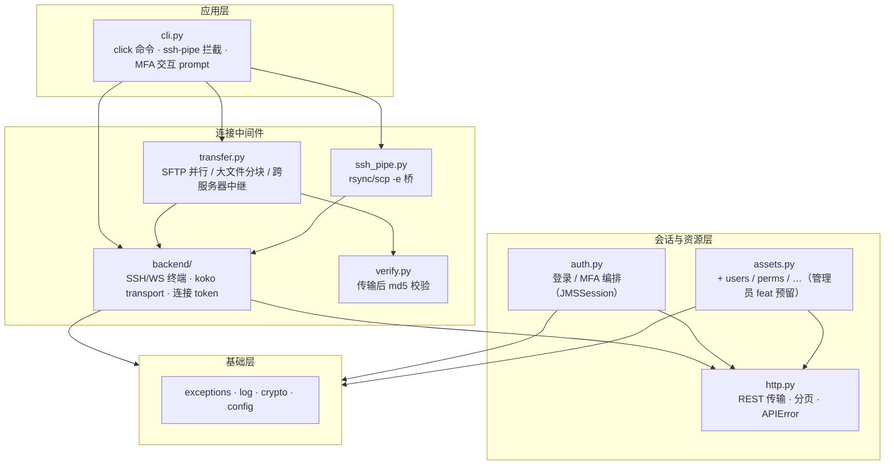

# DEVELOP.md — jms-cli 开发文档

> 内部开发文档，不随发布上线（正式 README 为英文）。面向开发者和 coding agent。

## 1. 分层架构



### 依赖规则

1. **只许上层 import 下层**，禁止下层 import 上层、禁止平层语义越层。
   反例（已修复方向）：`ssh_pipe.py` 曾绕过 backend 自建 `paramiko.Transport`——
   它在使用 backend 层的内部知识（KoKo 端口、token→SSH 凭据映射），必须与
   `backend/ssh.py` 共享 `open_koko_transport()`。
2. **库层零 CLI 关注点**：L0–L2 不得 import click / rich、不得交互输入、不得
   `sys.exit`。交互一律回调注入（如 `JMSSession(otp_prompt=...)`，默认实现由
   cli.py 提供）。诊断输出走 `jms.log` 的 named logger（stderr），绝不污染
   stdout（ssh-pipe 的 stdout 是 rsync 协议字节）。
3. **公开 API 收敛在 `jms/__init__.py`**：库用户只从顶层 import
   （`JMSSession` / `connect` / `AssetInfo` / `load_config` / 异常族），
   内部包结构不构成公开契约。

### 模块职责

| 模块 | 职责 | 允许依赖 |
|---|---|---|
| `exceptions.py` | 异常族（JMSError 及子类，含 `APIError` 带 status_code） | 无 |
| `log.py` | named logger，stderr，级别校验 | exceptions |
| `crypto.py` | AES-256-GCM 加解密，PBKDF2(host+username) 派生 | exceptions |
| `config.py` | config.yaml 读写（safe_load/safe_dump）、0600、惰性解密 | crypto, platformdirs |
| `http.py` | REST 传输：`api_get/post/patch/delete`、分页迭代器、`APIError` | exceptions, log |
| `auth.py` | 双重认证 + MFA 编排（otp_prompt 注入），继承 http 传输 | http |
| `assets.py` | 资产资源：搜索/解析/账号协议选择 | http（经 auth 会话） |
| `backend/` | KoKo 连接：token、SSH/WS 终端、`open_koko_transport` | auth, assets |
| `verify.py` | 本地/远程 md5 比对（RemoteHasher 走终端 execute） | backend |
| `transfer.py` | SFTP 并行/分块/中继，FileTask/TaskResult 契约 | backend, verify |
| `ssh_pipe.py` | rsync/scp `-e` 桥，`run_bridge(asset, server, cmd) -> int` | backend, config, assets |
| `cli.py` | 全部命令走 click（含 `ssh-pipe`：参数解析在 cli，桥逻辑调 `run_bridge`） | 全部 |

### 基于 CLI 的操作（发布面参考）

仓库本身是**客户端工具**，运维操作全部通过 CLI 完成（无侵入式库路径配置逻辑，
配置只走 platformdirs + 隐藏 `--config` 选项）：

```bash
uv run jms config add prod            # 交互式添加服务器（先验证凭据）
uv run jms config list                # 列出服务器（默认项标 *）
uv run jms ls @prod -q mysql          # 按关键字搜资产
uv run jms exec web@prod 'df -h'      # 远程命令（-b ssh|ws|auto；透传远端退出码）
uv run jms login web@prod             # 交互 PTY，Ctrl+] 退出
uv run jms sftp ./f.tar.gz web@prod:/tmp/    # 上传/下载方向自动检测，-j N 并发
uv run jms sftp web@prod:/f other@prod:/g    # 跨服务器内存流式中继
rsync -avz -e "uv run jms ssh-pipe" ./dir/ web@prod:/data/   # 上传方向
```

## 2. 开发原则

1. **lib + cli 双用**：每个功能先落成库 API，cli.py 只做参数解析与输出格式化。
2. **平行模块拆 subagent**：无串联关系的模块派独立 subagent 并行开发，
   每个 subagent 只负责一个模块，主会话不堆代码；完成后过 code-review。
3. **代码风格**：全英文 docstring/注释（Google 风格）；全类型注解；配置对象
   `frozen=True` dataclass；flake8 `max-line-length=99`（ignore E203/W503）；
   无 `# -*- coding: utf-8 -*-` 头（Python 3 默认 UTF-8）。
4. **安全基线**：YAML 只 `safe_load`/`safe_dump`；config.yaml 0600（写入后
   chmod 兜底）；凭据 AES-256-GCM 加密存储；密码/TOTP/凭据**永不入库**
   （测试凭据只走环境变量）；远程命令拼接用 `shlex.quote`。
5. **最小改动**：不提前抽象；一个实现不配接口；能 stdlib 不依赖。
6. **Git**：一个 feature/修复一个 commit，信息带模块名；发布用
   `vX.Y.Z` annotated tag（pre-push hook 校验版本）。

## 3. 测试规则

### 三层策略

| 层 | 内容 | 需要服务器 |
|---|---|---|
| 纯函数单测 | crypto、config、select_account、strip_ansi、md5 解析、任务规划 | 否 |
| 解析回归 | 从真实接口**抓一次**响应样本 → 本地 mock 重放（防解析漂移） | 否 |
| 真实服务器测试 | 登录 MFA、token、SSH/WS exec、SFTP、ssh-pipe、CLI e2e | **是** |

原则：**不相信自己 mock 的协议**——JumpServer 的坑全在协议层（双重认证、
MFA 字段差异、WS 二进制帧、marker×2），mock 只能证明"代码按写法调了 mock"。
只有格式解析类函数允许用真实样本做 mock 回归。

### 真实服务器测试门控（动态 skip）

- 凭据只从环境变量读：`JMS_TEST_HOST` / `JMS_TEST_USERNAME` /
  `JMS_TEST_PASSWORD` / `JMS_TEST_OTP` / `JMS_TEST_ASSET`（可选默认
  `home_server`）。
- conftest.py 集中 fixture：env 缺失 → `pytest.mark.skipif`；TCP 不可达
  → fixture 内 `pytest.skip`（探活端口从 `base_url` 推导，不硬编码 443）。
- **CI（GitHub Actions）不设这些 env** → 真实测试自动全 skip，只跑纯函数
  与解析回归两层。
- 脆弱 mock 禁止：不断言实现细节（`assert_called_once_with` 同义反复）、
  不对不存在的模块做鸭子类型契约测试。

### CLI 命令测试

- click `CliRunner` + 真实服务器（同样 skip 门控）：ls / exec / sftp 基本路径。
- `uv build` 后 smoke：`jms --help` / `jms --version`。

## 5. 已知问题（Known Issues）

- **rsync 下载方向 >4KB 会挂起**（KoKo 通道半关闭问题）：本地 rsync 收完
  flist 后主动半关闭 stdin，桥把 EOF 转成 SSH channel EOF 时 KoKo 会掐掉
  整个 channel（剩余数据丢失 → relay_out 永久阻塞）；不转发 EOF 则远端
  sender 干等请求同样挂死。已排除：版本不兼容（原生管道 3.4.4←3.2.7 下载
  md5 一致）、桥字节损坏（cat 5MB / 双向 echo 2MB / 突发 32KB×100 均
  byte-perfect）。**缓解**：下载走 `jms sftp`（已验证 md5 一致），rsync
  仅用于上传方向；潜在修复方向是延迟 EOF（relay_out 收完再 shutdown_write），
  待验证。见 `ssh_pipe.py`。

## 4. TODO 规划

### 近期（当前开发线）

- [x] `auth.py` 拆出 `http.py`（REST 传输泛化 + 分页 + `APIError`）
- [x] `jms/__init__.py` 公开 API 导出
- [x] `open_koko_transport()` 共享，ssh_pipe 删手工 Transport
- [x] `transfer.py` 落地（verify 的 FileTask/TaskResult 契约转正）
- [x] `cli.py` 全命令落地后删除 `terminal.py` 转发门面（连同 F401 豁免）
- [ ] 测试重组：删脆弱 mock，补 token / ssh-pipe / CLI e2e 真实用例

### feat 规划（架构已预留，暂不开发）

- [ ] **管理员操作**：资产 CRUD、用户管理、授权管理——在 `http.py` 地基上
      平级新增 `users.py` / `perms.py` 等资源模块（扁平结构，≥3 个资源
      模块再考虑 `resources/` 子包）
- [ ] **GitHub Actions CI**：纯函数 + 解析回归全跑，真实服务器测试自动 skip
- [ ] **依赖审计**：`uvx pip-audit` 入 CI；评估 paramiko/cryptography 主版本上界
- [ ] 资产 >100 时分页精确匹配（`search_assets` limit 硬编码退化问题）
